# 2025/2026

Kurz **Programování na Nuselské** bude probíhat od 18. září 2025
a volně navazuje na kurz **začátečníci**. Je určen pro děti druhých
až pátých tříd libovolné základní školy s tím, že děti druhých
tříd musí mít absolvovaný kurz začátečníci, šikovní jedinci z
řad třetích či čtvrtých tříd mohou přijít i bez předchozího
vzdělání.

Cílem tohoto kurzu je pokračování v rozvoji systematického
myšlení, hlubší poznávání světa informační techniky
a osvojení si základů elektrotechniky.

Kurz bude probíhat 1x týdně, každý čtvrtek od 14:15 do 15:05
v počítačové učebně.

V kurzu budeme využívat robůtky [Cubetto](https://www.primotoys.com),
[Beebot](https://www.bee-bot.us/) i [Ozobot](https://ozobot.com/).
Později si představíme platformu [Micro:bit](https://microbit.org)
a s ní zabředneme trochu blíže k elektrotechnice. Kromě těchto
se budeme věnovat i práci na PC, kde se budeme učit programovat
pomocí vybraných kurzů na [code.org](https://www.code.org),
prostředí [scratch](https://scratch.mit.edu/) a dalších.
To vše proložíme tvůrčími aktivitami s papírem, kostkami a jinými
rekvizitami.

Cílem kurzu není vzdělat hotového programátora, ale rozvíjet logické
myšlení, algoritmizaci a jiné vlastnosti, které se dětem budou hodit
při studiu jakéhokoliv oboru.

Kurz bude organizován a veden [Lukášem Doktorem](../lectors/ldoktor)

## 1. hodina (2025-09-18)

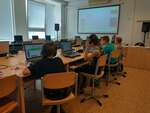

* Seznámení s prvním tématem - HTML stránky
* Ukázková stránka s různými prvky a hledání easter-eggů [zde](https://ldoktor.github.io/assets/html/)
  * Pokud rodiče dovolí, můžete hledat dále. Všechny easter-eggy nebyly ještě nalezeny
* Přihlášení do [code.org](https://www.code.org) pomocí hesel

## 2. hodina (2025-09-25)

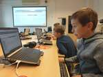

* [code.org](https://www.code.org)
  * Co jsou to tagy; některé jsme si vyzkoušeli použít
  * ``<head></head>`` - hlavička (obecné informace pro prohlížeč)
  * ``<body></head>`` - tělo (to co vidí uživatel)
  * ``<h1></h1>`` - (headding) velký nadpis (dále pak menší a menší pod-nadpisy `<h2><h3><h4>...`)
  * ``<p></p>`` - (paragraph) odstavec (html ignoruje mezery a entery při formátování)

## 3. hodina (2025-10-02)

* [code.org](https://www.code.org)
  * Opakovací hodina (pro nemocné)
* Ti kdož nepotřebovali opakovat se věnovali psaní všemi deseti, zonerai, skřítkům a podobným

## 4. hodina (2025-10-09)

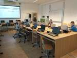

* [code.org](https://www.code.org)
  * Procvičování tagů nadpisu ``<h1>Nadpis</h1>``
  * Seznámení se seznamem ``<ul><li>prvek1</li><li>prvek2</li></ul>``
  * Zlepšování se v odhalování chyb (začnu jeden tag, ukončím jiný; ukončím tag, který nezačal; přeházený vstup; ...)

## 5. hodina (2025-10-16)

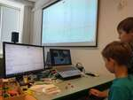

* Praktická ukázka postarší hry
  * Demoverze k dispozici například [zde](https://archive.org/details/DriverDemo)
  * Zklkamaly nás počítače, hra fungovala pouze na učitelském, proto jsme využili učitelský a můj notebook; po krátkém hledání to vypadá na problémy s Windows 10, proto doporučuji GNU/Linux (wine/lutris/proton), případně mohou pomoci ovladače [dgVoodoo](https://www.pcgamingwiki.com/wiki/DgVoodoo_2), pokud bude čas, můžeme někdy opět vyzkoušet
  * Ukázali jsme si lehce adresářovou strukturu:
    * ``Audio/`` - Zvuky, můžeme nahradit vlastními
    * ``Levels/`` - Mapy, nelehké úpravy, takže nezajímavé
    * ``Scripts/Events`` - Události, které se mohou dít když cestujeme po mapě, nebo je spouštět - zajímavé, ale moc toho neuděláme
    * ``Scripts/Missions`` - Definice misí - nejzajímavější, v demoverzi se vždy spustí skript ``mission661.dms`` a můžeme si ji trošku upravit
  * Nejzajímavějším zjištěním byl prostý formát definice misí a fakt, že demoverze nám dovolí jakékoliv úpravy v souboru ``Scripts/Missions/mission661.dms``, například:
    * Vypnutí časovače (``Countdown``), abychom získali víc času na hraní
    * Změna cíle (``SetTarget 0,1,917,398517``), čímž se vyhneme splnění mise a ukončení hry
    * Vypnutí ničení (``DisablePlayerDamage``), čímž nás tolik netrápí policisté
    * Případně vypnutí policistů kompletně (``cops_off``) a můžeme jezdil dle libosti
  * Následně jsme si vyzkoušeli splnit [upravenou misi](driver.dms) (v základu nesplnitelná, je nutnost upravit podmínky, kreativitě se meze nekladou)

## 6. hodina (2025-10-23)

* [code.org](https://www.code.org)
  * Ukázali jsme si CSS - kaskádové styly, které se používají pro definici stylu (barvy, pozice, efektů) na HTML stránce
  * Styl můžeme "importovat" pomocí ``<link rel="stylesheet" href="nas_styl.css">`` v hlavičce naší HTML stránce
  * Následně v tomto dokumentu můžeme definovat styl jednotlivým elementům na základě typu/tagu/třídy, např.:

stranka.html

```html
<!DOCTYPE html>
<html>
<head>
  <!-- Hlavička stránky, sem jdou informace pro počítač -->
  <link rel="stylesheet" href="nas_styl.css">
  <meta charset="UTF-8">
</head>
<body>
  <!-- Tělo naší stránky, sem jdou veci co chceme uživateli zobrazi -->
  <h1>Nadpis</h1>
  <p>Nějaký text</p>
</body>
```

nas_styl.css

```css
/* Nastavíme pozadí těla stránky */
body {
  background-color: lightblue;
}

/* Nastavíme barvu, zarovnání a velikost písma nadpisu h1 */
h1 {
  color: rgb(0, 255, 128);
  font-size: 70px
  text-align: center;
}

/* Nastavíme druh, barvu a velikost písma textu odstavce p */
p {
  font-family: verdana;
  font-size: 20px;
  color: #ffcc11
}
```

## 7. hodina (2025-10-30)

* [html stránky](/programovani-html)
  * Distribuce hesel
  * Neúspěšný pokus o využití WebTop tenkých klientů skrz prohlížeč. Loni nám to jakž-takž fungovalo, letos byly latence příliš veliké (prostě se to sekalo natolik, že se to nedalo použít). Budeme si muset vystačit s Windows a portable verzemi programů.
  * Vytvoření účtů na lokálně hostovaném Gogs (jednoduchá alternativa github/gitlab, využijeme v dalších hodinách)

## 8. hodina (2025-11-06)

* [html stránky](/programovani-html)
  * Úvod do [gitu](/programovani-html/verzovani.html)
  * Největší boj byla příkazová řádka ``git-bash.exe``:
    * ``ls`` = zobraz obsah složky *list directory*
    * ``cd $kam`` = změň adresář *change directory*
    * ``pwd`` = kde jsem *print working directory*
  * Z gitu jsme udělali:
    * ``git init .`` - inicializuj git repozitář v aktuální složce
    * ``git add $soubor`` - připrav aktuální verzi souboru k začlenění
    * ``git commit -a`` - zaznamenej připravené soubory jako novou revizi (commit) a připoj změny ve všech dříve přidaných souborech (``-a``)

## 9. hodina (2025-11-13)

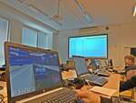

* [html stránky](/programovani-html)
  * Pokračování v [gitu](/programovani-html/verzovani.html)
  * Děti dostaly [tahák](https://ldoktor.github.io/programovani-html/git.pdf)
  * Pro usnadnění navigace jsme využili ``git-gui``
  * Upravovali jsme demo-misi hry [driver](https://archive.org/details/DriverDemo), zkoumali jsme ``diffy`` (rozdíl od předchozí verze), vytvářeli ``commity`` (zapsané revize s komentářem) a na závěr jsme se ještě zkusili ``checkoutnout`` předchozí verzi a zpět. Všechny změny jsme samozřejmě řádně otestovali.

## 10. hodina (2025-11-20)

* [html stránky](/programovani-html)
  * Těžká hodina. Podívali jsme se na to jak funguje "upstream development" (vývoj v upstreamu u programů s otevřeným zdrojovým kódem), poslední kapitola z [našeho dokumentu o gitu](/programovani-html/verzovani.html). Cílem hodiny bylo připravit prostředí pro tvorbu našich webových stránek přesně tímto způsobem. Ještě nám chybí přidání upstream repozitářů a budeme se konečně moci věnovat HTML stránkám. Pro zjednodušení jsme využili [vscode](https://code.visualstudio.com/) se kterým se v následujících hodinách více seznámíme.

## 11. hodina (2025-11-27)

* [html stránky](/programovani-html)
  * Donastavili jsme "upstream" repozitář pomocí ``git remote add upstream $ADRESA``
  * Prohlédli jsme si adresářovou strukturu projektu
  * Zkopírovali jsme si template.html a začali tvořit novou stránku o naší hře

## 12. hodina (2025-12-04)

* [html stránky](/programovani-html)
  * Vlastní tvorba popisu oblíbené hry
  * Někteří stihli i přidat obrázky

## 13. hodina (2025-12-11)

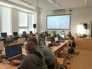
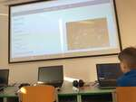

* [html stránky](/programovani-html)
  * Pokračování ve tvorbě webové stránky o oblíbené hře
  * Ke konci demonstrace co nás čeká příště (git push)

## 14. hodina (2025-12-18)

* [html stránky](/programovani-html)
  * "Commitnutí" změn a jejich publikování do našich "vzdálených" repozitářů. Malinko jsme zápasili se nastavením (falešných) emailových adres a jmen, které jsou vyžadovány pro "git commit" a následně i se zadáním hesel, ale nakonec se zadařilo všem.

## 15. hodina (2026-01-08)

* [html stránky](/programovani-html)
  * Dodělání stránek
  * Ti co měli hotovo se pokusili vylepšit styl stránky pomocí vlastních CSS stylů

## 16. hodina (2026-01-15)

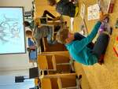

* [html stránky](/programovani-html)
  * Kaskádové styly (CSS)
  * Seznámení s LLM (large language models = velké jazykové modely), co to je, co to není, [pěkné video od NEZkreslené vědy](https://www.youtube.com/watch?v=Wg9gbEa28D8)
  * Použití AI ke generování CSS k naší stránce, následné dotváření a úpravy s jejím využitím
* Boffin
  * Někteří si chtěli dát od HTML pauzu a tak raději zapojovali různá zapojení ze stavebnic Boffin

* * * * * * * * * * * *

## 17. hodina (2026-01-22)

* [html stránky](/programovani-html)
  * Dokončení "šílených" stylů
  * Naše stránky (zpravidla ve 2 verzích, základní a šílená):
    * [crazygames](https://ldoktor.github.io/programovani-html/crazigames.html), [šílená](https://ldoktor.github.io/programovani-html/crazigames-crazy.html)
    * [polybridge](https://ldoktor.github.io/programovani-html/polybrige.html), [šílená](https://ldoktor.github.io/programovani-html/polybrige-crazy.html)
    * [fifa](https://ldoktor.github.io/programovani-html/fifa%2026.html), [šílená](https://ldoktor.github.io/programovani-html/fifa%2026-crazy.html)
    * [car master](https://ldoktor.github.io/programovani-html/car%20master.html)
    * [block blast](https://ldoktor.github.io/programovani-html/blokblast.html), [šílená](https://ldoktor.github.io/programovani-html/blokblast-crazy.html)
* Boffin
  * Někdo opět raději zapojoval elektronické obvody pomocí stavebnice Boffin

## 18. hodina (2026-02-05)

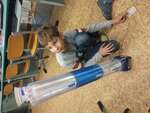
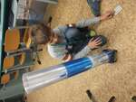
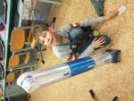
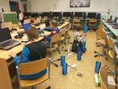

* [Vzduchový výtah](../assets/microbit/vytah)
  * Sestavení výtahu
  * Rozvedení napájení pomocí bread-boardů z trafa
  * Test výtahu připojením napájení přes tlačítko na větráčky, ovládání ručním přerušováním


<div id="overlay" class="overlay hidden">
  <span id="prev" class="nav">&#9664;</span>
  
  <span id="next" class="nav">&#9654;</span>
  <span id="close" class="close">&times;</span>
</div>
<link rel="stylesheet" href="/assets/gallery.css">
<script src="/assets/gallery.js"></script>


