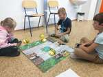
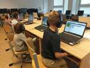
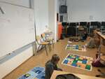
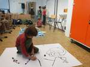
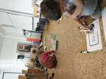
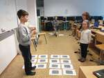
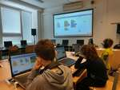

# 2025/2026

Kurz **Programování na Nuselské** bude probíhat od 18. září 2025
a je určen pro děti prvních[1](#footnote1) a druhých
tříd dětí z libovolných škol. Cílem těchto kurzů je rozvíjení
přirozené touhy dětí po poznávání okolního světa s důrazem na
techniku a rozvoj systematického myšlení.

Kurz bude probíhat 1x týdně každý čtvrtek od 13:15 do 14:05 v počítačové
učebně.

V kurzu budeme využívat robůtky [Cubetto](https://www.primotoys.com),
[Beebot](https://www.bee-bot.us/) i [Ozobot](https://ozobot.com/).
Zároveň se budeme věnovat i práci na PC pomocí open source aplikace
[GCompris](https://gcompris.net) a začneme kurzy z platformy
[code.org](https://[www.code.org](https://www.code.org)). Pro zpestření budou kurzy provázeny
tvůrčími aktivitami s papírem, kostkami a jinými rekvizitami.

Cílem kurzu není vzdělat hotového programátora, ale rozvíjet logické
myšlení, algoritmizaci a jiné vlastnosti, které se dětem budou hodit
při studiu jakéhokoliv oboru.

Kurz bude organizován a veden [Lukášem Doktorem](../lectors/ldoktor)

## 1. hodina (2025-09-18)

* Seznámení s Beeboty - většina znala, takže jsme se rovnou vrhnuli na herní plán
* Přihlášení do [code.org](https://www.code.org) pomocí obrázkových hesel a pár lekcí z "tančení párty"

## 2. hodina (2025-09-25)

* [code.org](https://www.code.org)
  * Něco málo z "taneční párty"
  * Bludiště s "Angry birds"
* Jako zábava na konec jsme se snažili dostat co nejblíže se včelkami k mým nohám bez kolize

## 3. hodina (2025-10-02)

* Beeboti
  * Umístění na mapě A3, B6, E4, ...
  * Směr N - North (sever), S - South (jih), W - West (západ), E - East (východ)
  * Přesné určení na mapě je tedy A3E, B6W, E4W, ...
  * Někteří zkoušeli složitější pohyb po mapě s omezeními či opakováním
* [code.org](https://www.code.org)
  * Bludiště s "Angry birds"
  * Někteří již "Ladí se Scratem"

## 4. hodina (2025-10-09)

* [code.org](https://www.code.org)
  * Bludiště s "Angry birds", "Ladění se Scratem", někdo i "Sbírání pokladů s Laurelem"
* Ozobot
  * Seznámení s robůtkem, který sleduje čáru a umí "číst" barvičky

## 5. hodina (2025-10-16)

* Beeboti
  * Zápis programu: ``$START $POKYN1 $POKYN2 ... $CÍL``
  * Např.: ``A1N ↻ ↻ ↑ ↑ ↺ A3W``
* Ozobot
  * testování na větší ploše, zklamaly nás fixy, takže se ozobotovi nechtělo moc poslouchat

## 6. hodina (2025-10-23)

* [code.org](https://www.code.org)
  * Vysvětlili jsme si bloček "opakuj", nejprve na písničce, následně s chozením po třídě a poté v code.org

## 7. hodina (2025-10-30)

* Cubetto
  * Seznámaní se s "Kubíkem"
  * Hra "popiš a najdi" (Kubík se nudí; druhý dojede tam, kde by se Kubík zabavil a vysvětlí, proč to odpovídá zadání)
* Ozobot
  * Řešení "stavitelských" úkolů (dostaň břemeno "ještěrkou" sem, odtlač bagrem hromadu cihel, ...)

## 8. hodina (2025-11-06)

* Cubetto
  * Složitější trasy s využitím funkcí (dokola, jedním směrem)
  * Např. ``1x go; 8 bločků: B2 => C3 => D4 => E5``

## 9. hodina (2025-11-13)

* [code.org](https://www.code.org)
  * Pokračování a větší důraz na cykly
* Ozobot
  * Řešení "stavitelských" úkolů (dostaň břemeno "ještěrkou" sem, odtlač bagrem hromadu cihel, ...)

## 10. hodina (2025-11-20)

* [Scratch](https://scratch.mit.edu)
  * Seznámení s prostředím
* Ozobot
  * Řešení "stavitelských" úkolů (dostaň břemeno "ještěrkou" sem, odtlač bagrem hromadu cihel, ...)

## 11. hodina (2025-11-27)

* [Scratch](https://scratch.mit.edu)
  * Jednoduchá hra [chytni zvířátko](https://scratch.mit.edu/projects/470669556/)
  * Vyzkoušeli jsme si přidat zvířátko, nechali jsme jej běhat po obrazovce, přidali jsme si proměnnou a po kliknutí jsme proměnnou zvyšovali o 1 (i více) bodů

* * * * * * * * *

  &#9664;
  
  &#9654;
  &times;

<link rel="stylesheet" href="/assets/gallery.css">

<a name="footnote1">1</a>: Dle psychologa [Jeana Piageta](https://cs.wikipedia.org/wiki/Jean\_Piaget)
nelze děti mladší 6-7 let učit systematické vědy, neboť se nacházejí
ve stádiu `názorového (prelogického) myšlení`, které ještě plně
nerespektuje logiku. Ukázka experimentu je ke shlédnutí například
[zde](https://www.youtube.com/watch?v=tQLpysTbFso) (doporučuji vyzkoušet),
výuka mateřského jazyku začíná také daleko dříve, než je děťátko schopné
jej pochopit a přirozeně se vytváří návyky a spoje, jež jednou vedou v
schopnost mluvit a myslet v daném jazyce. Bilingvální výchova pak vede
ke schopnosti mluvit a myslet ve více jazycích. Proto věřím, že správným
přístupem lze začít daleko dříve a sám využívám logické hry, roboty i
počítač ke hře a vlastně i výuce svých dětí takřka od narození.

